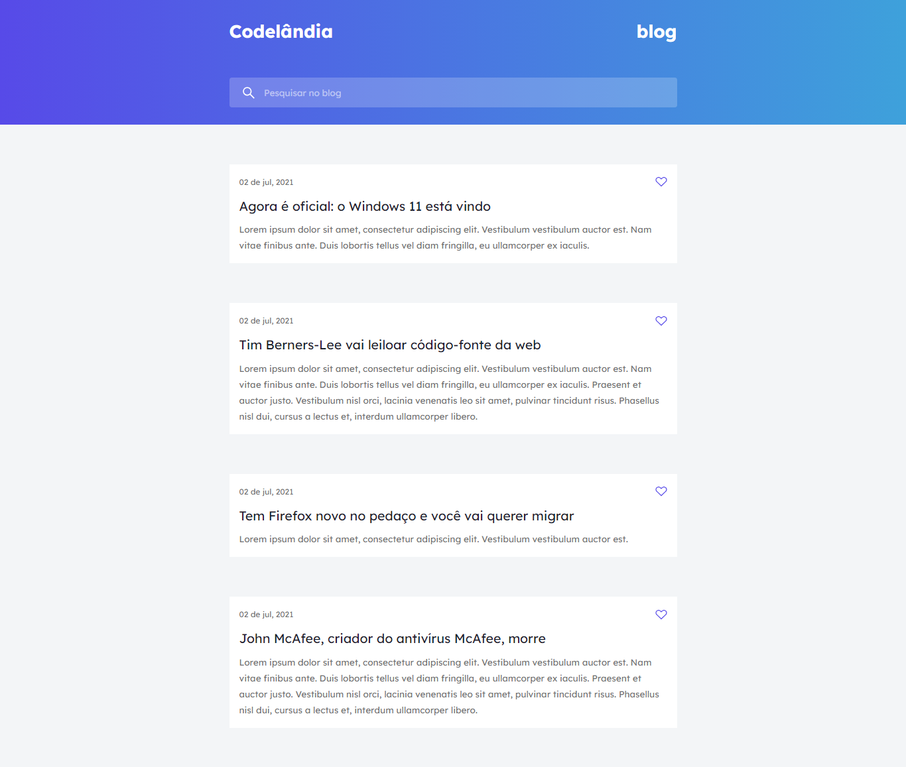

# Mini Blog - HTML e CSS

Este repositório contém um mini blog criado com HTML e CSS, desenvolvido para treinar e aprimorar habilidades no front-end. O projeto não possui funcionalidades, apenas o design e a estrutura do front-end do blog.

<a href="https://mini-blog-codelandia.netlify.app">Link</a>

## Descrição

O mini blog é um projeto de estudo que tem como objetivo praticar o desenvolvimento front-end utilizando HTML e CSS. O foco do projeto é criar um layout atraente e responsivo para um blog fictício, sem a implementação de funcionalidades de back-end.

## Funcionalidades

- Estrutura de um blog fictício
- Design responsivo para diferentes dispositivos

## Tecnologias Utilizadas

- HTML5
- CSS3

## Como Usar

1. Clone ou faça o download deste repositório para o seu ambiente local.

2. Abra o arquivo `index.html` em um navegador da web.

3. Navegue pelas páginas do blog para visualizar o layout e o design criados.

## Contribuindo

Este projeto foi desenvolvido com o propósito de treinar habilidades no front-end e, portanto, não são aceitas contribuições externas neste momento.

## Licença

Este projeto é apenas para fins de estudo e não possui uma licença específica.

